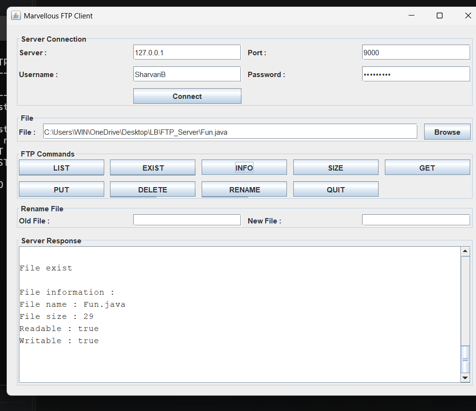

# FTP Server-Client

A Java-based FTP Server-Client application developed using **Socket Programming**, **Multithreading**, **File Handling**, and **Java Swing**.

The application allows a client to connect to the server and perform different file operations such as listing, checking, viewing file information, uploading, downloading, renaming, and deleting files.

---

## Features

* Client-Server communication using TCP Socket Programming
* Multiple client support using Multithreading
* File upload from Client to Server
* File download from Server to Client
* List files available on the Server
* Check whether a file exists
* Display file information
* Display file size
* Rename files
* Delete files
* GUI-based Client using Java Swing
* Command-based file operations
* Exception handling
* File transfer using byte streams

---

## Technologies Used

* **Java**
* **Java Socket Programming**
* **TCP/IP**
* **Multithreading**
* **Java I/O**
* **Java Swing**

---

## Project Structure

```text
FTP-Server-Client/
│
├── Server.java
├── FTPClient.java
├── ClientGUI.java
├── README.md
│
└── screenshots/
    ├── connection.png
    ├── file-information.png
    ├── command-execution.png
    └── upload-download.png
```

---

## How It Works

The project follows a **Client-Server Architecture**.

```text
              TCP Connection
      ┌──────────────────────────┐
      │                          │
      ▼                          ▼
┌──────────┐                ┌──────────┐
│  Client  │  ◄──────────►  │  Server  │
│   GUI    │                │          │
└──────────┘                └──────────┘
      │                          │
      │                          │
      ▼                          ▼
 Client Files                Server Files
```

The server listens for client connections on **port 9000**.

When a client connects, the server creates a separate thread to handle that client request.

---

## Supported Commands

| Command                              | Description                            |
| ------------------------------------ | -------------------------------------- |
| `LIST`                               | Displays files available on the server |
| `EXIST <FileName>`                   | Checks whether a file exists           |
| `INFO <FileName>`                    | Displays file information              |
| `SIZE <FileName>`                    | Displays file size                     |
| `GET <FileName>`                     | Downloads a file from server           |
| `PUT <FileName>`                     | Uploads a file to server               |
| `RENAME <OldFileName> <NewFileName>` | Renames a file                         |
| `DELETE <FileName>`                  | Deletes a file                         |
| `QUIT`                               | Disconnects the client                 |

---

## How to Run

### 1. Compile the Server

Open Command Prompt in the project directory and run:

```bash
javac Server.java
```

### 2. Start the Server

```bash
java Server
```

The server will start on port `9000`.

---

### 3. Compile the Client

Open another Command Prompt in the same project directory and run:

```bash
javac FTPClient.java ClientGUI.java
```

### 4. Start the Client GUI

```bash
java ClientGUI
```

---

## File Transfer

### Upload

The `PUT` operation transfers a file from the **Client to the Server**.

```text
Client ───────────────► Server
         File Upload
```

### Download

The `GET` operation transfers a file from the **Server to the Client**.

```text
Client ◄─────────────── Server
        File Download
```

---

## Screenshots

### Client-Server Connection


### File Information



### FTP Server Command Execution


### File Upload and Download


---

## Concepts Demonstrated

This project demonstrates practical implementation of:

* TCP Socket Programming
* Client-Server Architecture
* Multithreading
* Java I/O Streams
* File Handling
* Byte Stream File Transfer
* Java Swing GUI
* Exception Handling
* Command Processing

---

## Future Improvements

* User authentication
* Secure file transfer
* Progress bar for file uploads/downloads
* Improved GUI design
* File transfer status and progress information
* Better synchronization for simultaneous file operations
* Support for directory creation and navigation

---
