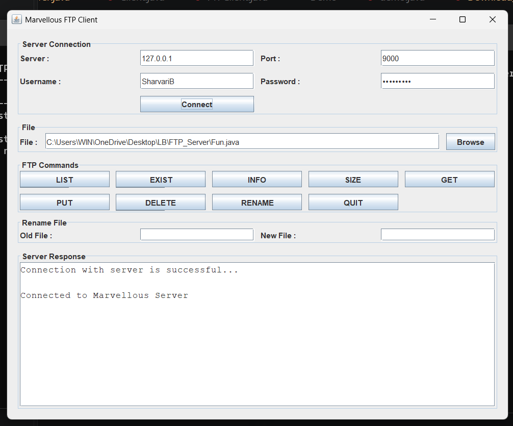
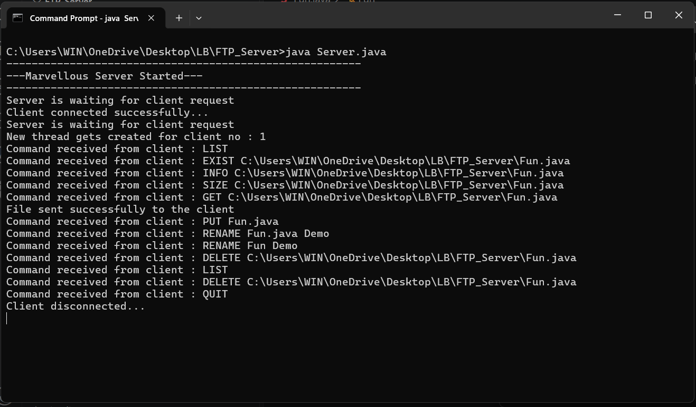
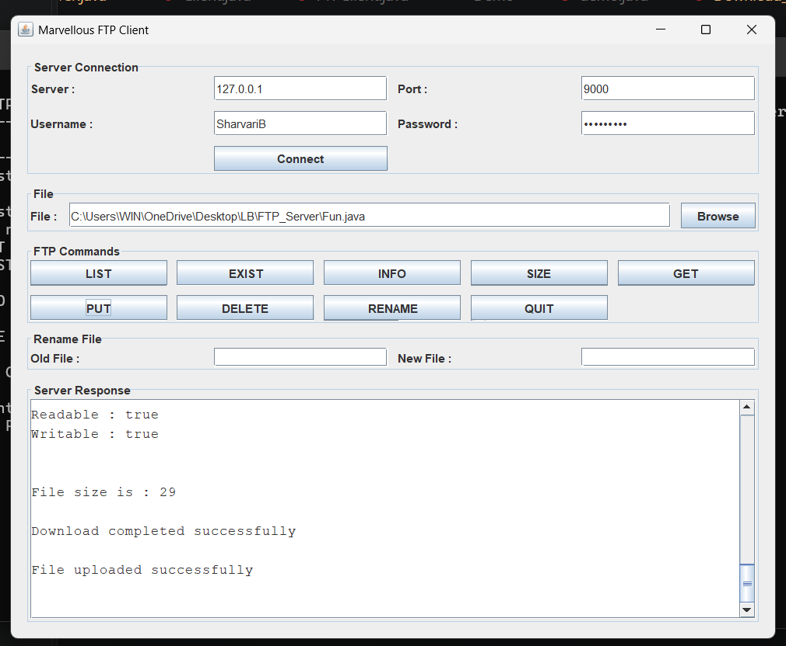

# FTP Server-Client

A Java-based FTP Server-Client application that demonstrates **TCP Socket Programming, Multithreading, File Handling, Java I/O, and Java Swing**.

The application allows a client to connect to the server and perform different file operations such as listing, checking, viewing information, uploading, downloading, renaming, and deleting files.

---

## Features

* TCP-based Client-Server communication
* Multiple client support using Multithreading
* GUI-based Client using Java Swing
* File upload from Client to Server
* File download from Server to Client
* List files available on the Server
* Check whether a file exists
* Display file information
* Display file size
* Rename files
* Delete files
* Command-based file operations
* File transfer using byte streams
* Exception handling

---

## Technologies Used

* **Java**
* **Java Socket Programming**
* **TCP/IP**
* **Multithreading**
* **Java I/O**
* **Java Swing**

---

## Project Structure

```text
FTP-Server-Client/
│
├── Server.java
├── FTPClient.java
├── ClientGUI.java
├── README.md
│
└── screenshots/
    ├── connection.png
    ├── file-information.png
    ├── command-execution.png
    └── upload-download.png
```

---

## System Architecture

The project follows a **Client-Server Architecture**.

```text
                    TCP Connection
              ┌──────────────────────┐
              │                      │
              ▼                      ▼
        ┌───────────┐          ┌───────────┐
        │  Client   │          │  Server   │
        │    GUI    │◄────────►│           │
        └───────────┘          └───────────┘
              │                      │
              ▼                      ▼
        Client Files           Server Files
```

The server listens for client connections on **port 9000**.

When a client connects, the server creates a separate thread to handle that client.

This allows multiple clients to communicate with the server independently.

---

## Java Files

### Server.java

Responsible for:

* Starting the server
* Listening for client connections
* Accepting client requests
* Creating a separate thread for each client
* Processing FTP commands
* Handling file operations
* Sending files to the client
* Receiving files from the client

### FTPClient.java

Responsible for:

* Establishing connection with the server
* Sending commands to the server
* Receiving server responses
* Uploading files
* Downloading files
* Performing file operations

### ClientGUI.java

Provides a graphical interface using **Java Swing**.

The GUI allows the user to:

* Connect to the server
* Enter file names
* Execute file operations
* Upload files
* Download files
* Rename files
* Delete files
* View server responses

---

## Supported Commands

| Command                              | Description                            |
| ------------------------------------ | -------------------------------------- |
| `LIST`                               | Displays files available on the server |
| `EXIST <FileName>`                   | Checks whether a file exists           |
| `INFO <FileName>`                    | Displays file information              |
| `SIZE <FileName>`                    | Displays the size of a file            |
| `GET <FileName>`                     | Downloads a file from the server       |
| `PUT <FileName>`                     | Uploads a file to the server           |
| `RENAME <OldFileName> <NewFileName>` | Renames a file                         |
| `DELETE <FileName>`                  | Deletes a file                         |
| `QUIT`                               | Disconnects the client                 |

---

## File Transfer

### Upload

The `PUT` command is used to upload a file from the client to the server.

```text
Client
   │
   │ PUT FileName
   │
   ▼
Server
   │
   ▼
File stored on Server
```

### Download

The `GET` command is used to download a file from the server to the client.

```text
Client
   ▲
   │ GET FileName
   │
   │ File
   │
Server
```

---

## How to Run

### Step 1: Open the Project Directory

Open Command Prompt or Terminal inside the `FTP-Server-Client` folder.

---

### Step 2: Compile the Server

```bash
javac Server.java
```

---

### Step 3: Start the Server

```bash
java Server
```

The server will start and listen on:

```text
Port: 9000
```

You should see a message similar to:

```text
--------------------------------------------------------
---Marvellous Server Started---
--------------------------------------------------------
Server is waiting for client request
```

---

### Step 4: Compile the Client

Open another Command Prompt or Terminal in the same project directory.

```bash
javac FTPClient.java ClientGUI.java
```

---

### Step 5: Start the Client GUI

```bash
java ClientGUI
```

The Client GUI will open.

Enter the server details and connect to the server.

---

## Example Workflow

```text
1. Start Server
        ↓
2. Start Client GUI
        ↓
3. Connect Client to Server
        ↓
4. Select File Operation
        ↓
5. Send Request to Server
        ↓
6. Server Processes Request
        ↓
7. Server Sends Response
        ↓
8. Client Displays Result
```

---

## Screenshots

### Client-Server Connection



### File Information


### FTP Server Command Execution



### File Upload and Download



---

## Concepts Demonstrated

This project demonstrates practical implementation of the following Java concepts:

* **Socket Programming**
* **Client-Server Architecture**
* **TCP Communication**
* **Multithreading**
* **Java I/O Streams**
* **DataInputStream**
* **DataOutputStream**
* **FileInputStream**
* **FileOutputStream**
* **File Handling**
* **Byte Stream File Transfer**
* **Java Swing**
* **Exception Handling**
* **Command Processing**
* **Thread-based Client Handling**

---

## Future Improvements

* User authentication
* Secure file transfer
* Password-based login
* File transfer progress bar
* Improved GUI design
* Transfer status information
* Directory creation
* Directory navigation
* Better synchronization for simultaneous file operations
* Improved error handling

---

## Conclusion

This project demonstrates how **Java Socket Programming and Multithreading** can be used to build a basic FTP-style Client-Server application.

It provides practical experience with **network communication, file transfer, Java I/O, multithreading, and GUI development**.
