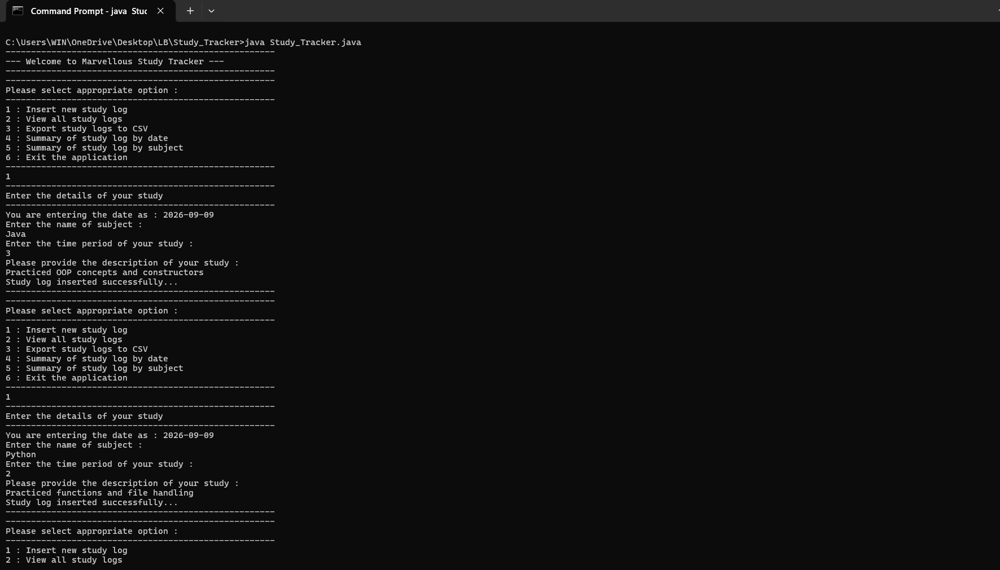
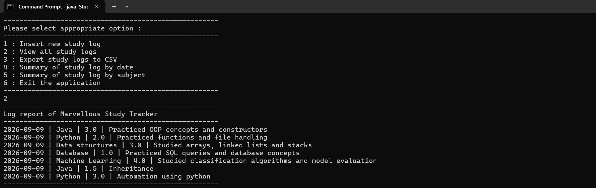
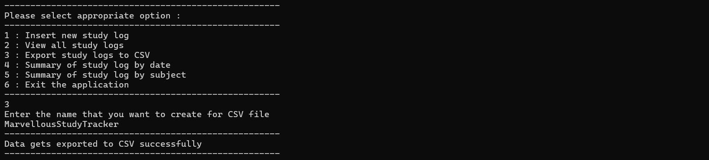
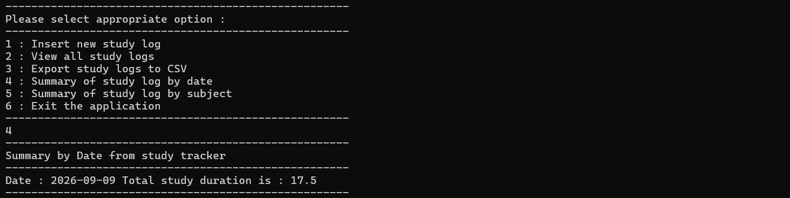
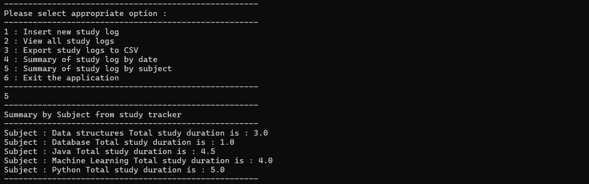

# Study Tracker – Core Java Application

## 📌 Project Overview

Study Tracker is a console-based Java application developed using Core Java. It allows users to record their daily study activities, view study logs, export records to a CSV file, and generate summaries based on date and subject.

The project demonstrates the practical use of Java programming concepts such as OOP, Collections, Date/Time API, file handling, exception handling, and menu-driven programming.

## 🚀 Features

* Insert new study logs
* View all study logs
* Export study logs to CSV
* Generate summary by date
* Generate summary by subject
* Calculate total study duration
* Menu-driven console interface
* Exception handling for file operations

## 🛠️ Technologies Used

* Java
* Core Java
* OOP
* ArrayList
* TreeMap
* Java Date/Time API
* File Handling
* CSV File Handling
* Exception Handling
* Scanner

## 📂 Project Structure

```text
Study-Tracker/
│
├── StudyTracker.java
├── README.md
│
└── Screenshots/
    ├── 01_Insert_Study_Log.png
    ├── 02_View_Study_Logs.png
    ├── 03_CSV_Export.png
    ├── 04_Summary_By_Date.png
    └── 05_Summary_By_Subject.png
```

## 🧩 Classes

### StudyLog

Represents an individual study record containing:

* Date
* Subject
* Duration
* Description

### StudyTracker

Manages study records and provides operations such as:

* InsertLog()
* DisplayLog()
* ExportToCSV()
* SummaryByDate()
* SummaryBySubject()

### StudyTrackerApp

Provides the menu-driven interface and allows the user to interact with the application.

## ▶️ How to Run

### 1. Compile the program

```bash
javac StudyTracker.java
```

### 2. Run the application

```bash
java StudyTrackerApp
```

## 📸 Screenshots

### 1. Insert Study Log



### 2. View Study Logs



### 3. CSV Export



### 4. Summary By Date



### 5. Summary By Subject




## 📚 Java Concepts Demonstrated

* Classes and Objects
* Encapsulation
* Constructors
* Method Overriding
* ArrayList
* TreeMap
* Enhanced for loop
* Switch-case
* Do-while loop
* Scanner
* LocalDate
* FileWriter
* Try-with-resources
* Exception Handling
* CSV Export

## 🎯 Learning Outcome

This project helped in understanding how Core Java concepts can be combined to build a practical menu-driven application. It also provides experience with collections, file handling, date management, and data summarization.

## 👩‍💻 Author

**Sharvari Bhosale**

Java | Python | Machine Learning | Automation

